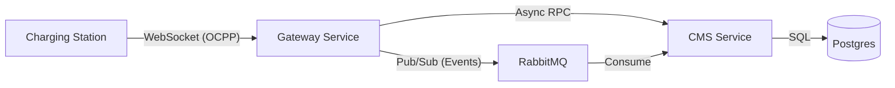

# OCPP 1.6 Backend Boilerplate Guide

This document provides a detailed overview of the generated Monorepo structure and a roadmap for transforming this boilerplate into a production-ready EV Charging Station Management System (CSMS).

## 1. Architecture Overview: The Gateway Pattern

The system is designed around the **Gateway Pattern**, strictly separating protocol handling from business logic.



- **Gateway (FastAPI)**:
  - **Stateful**: Maintains persistent WebSocket connections with Chargers.
  - **Dumb**: No business logic. It only translates OCPP messages to internal RPC calls or Events.
  - **Scalable**: Can be scaled horizontally (requires a Redis-based ConnectionRegistry in production, currently in-memory).

- **CMS (Nameko)**:
  - **Stateless**: Pure business logic.
  - **Worker**: Consumes tasks and events from RabbitMQ.
  - **Database Owner**: The only service that talks to the database.

## 2. Key Components & Files

### A. The Gateway (`/gateway`)
- **`main.py`**: The entrypoint. It defines the WebSocket route `/ocpp/{charge_point_id}` and starts the RabbitMQ consumer for remote commands.
- **`handlers/ocpp_handler.py`**: **The Critical Bridge**.
  - Inherits from `mobilityhouse/ocpp`.
  - **`on_boot_notification`**: Example of a **Call**. It pauses the WebSocket, calls Nameko via RPC (`aio_nameko_proxy`), waits for the result, and returns the OCPP response.
  - **`on_meter_values`**: Example of a **Notify**. It fires-and-forgets an event to RabbitMQ (`cms.events`) and immediately returns an empty OCPP response.
- **`connection_manager.py`**: A Singleton registry tracking active WebSockets. Required to route "Reverse" commands (e.g., RemoteStart) to the correct socket.

### B. The CMS Service (`/services/cms`)
- **`service.py`**: The Nameko Service definition.
  - **`@rpc`**: Exposes functions that the Gateway waits for (e.g., `process_boot`).
  - **`@event_handler`**: Listens for async events from the Gateway (e.g., `meter_values`).
- **`logic.py`**: Where your actual business rules live. Currently mocks database interactions.

## 3. What is Implemented vs. Mocked

| Feature | Status | Details |
| :--- | :--- | :--- |
| **Project Structure** | ✅ Done | Monorepo layout with Docker Compose |
| **OCPP Connection** | ✅ Done | WebSocket handshake & protocol upgrade |
| **BootNotification** | ✅ Done | Full flow: CS -> Gateway -> CMS -> Gateway -> CS |
| **MeterValues** | ✅ Done | Async flow: CS -> Gateway -> RabbitMQ -> CMS |
| **Remote Commands** | ⚠️ Partial | Infrastructure is there (RabbitMQ -> Gateway), but logic is basic |
| **Database** | ❌ Mocked | Postgres container exists, but code uses mock functions |
| **Authentication** | ❌ Missing | No OCPP `Authorize` handler implemented |

## 4. MobilityHouse/OCPP Library Integration

The project uses the `mobilityhouse/ocpp` library (v0.15+) to handle the low-level OCPP protocol details.

### How it works
1.  **Protocol Handshake**: The library handles the WebSocket subprotocol negotiation (`ocpp1.6`).
2.  **Message Parsing**: It automatically validates incoming JSON against the OCPP 1.6 JSON Schema.
3.  **Routing**: It uses decorators (`@on`) to route incoming messages to the correct method.

### Code Example
```python
from ocpp.v16 import ChargePoint as v16ChargePoint
from ocpp.v16 import call_result
from ocpp.v16.enums import Action

class ChargePoint(v16ChargePoint):
    # INCOMING: Handle a message from the Charger
    @on(Action.BootNotification)
    async def on_boot_notification(self, **kwargs):
        # 1. Do logic (call CMS)
        # 2. Return response
        return call_result.BootNotificationPayload(...)

    # OUTGOING: Send a message to the Charger
    async def send_remote_start(self):
        request = call.RemoteStartTransaction(id_tag="123")
        response = await self.call(request)
```

## 5. OCPP 1.6 Specification Compliance (FHWA/NEVI)

According to the specification (Chapters 4 & 5), the backend must handle the following operations.

### Chapter 4: Operations Initiated by Charge Point (Incoming)
These messages are sent **BY the Charger TO the Backend**. You must implement an `@on(Action.X)` handler for each of these in `gateway/handlers/ocpp_handler.py`.

| Operation | Priority | Description |
| :--- | :--- | :--- |
| **Authorize** | 🔴 High | Verify ID tag before starting charge. |
| **BootNotification** | 🔴 High | Charger startup. Handshake configuration. |
| **Heartbeat** | 🔴 High | Periodic "I am alive" signal. |
| **MeterValues** | 🔴 High | Periodic energy readings. Critical for billing. |
| **StartTransaction** | 🔴 High | Session start. Must generate a Transaction ID. |
| **StopTransaction** | 🔴 High | Session end. Final billing data. |
| **StatusNotification** | 🟡 Med | Charger status change (Available -> Charging). |
| **DataTransfer** | 🟢 Low | Vendor-specific extensions. |
| **DiagnosticsStatusNotification** | 🟢 Low | Status of log upload. |
| **FirmwareStatusNotification** | 🟢 Low | Status of firmware update. |

### Chapter 5: Operations Initiated by Central System (Outgoing)
These messages are sent **BY the Backend TO the Charger**. You must trigger these via the `gateway_commands` RabbitMQ exchange.

| Operation | Priority | Description |
| :--- | :--- | :--- |
| **RemoteStartTransaction** | 🔴 High | Start charging via App/API. |
| **RemoteStopTransaction** | 🔴 High | Stop charging via App/API. |
| **Reset** | 🔴 High | Reboot the charger (Soft/Hard). |
| **UnlockConnector** | 🟡 Med | Force unlock a stuck cable. |
| **ChangeConfiguration** | 🟡 Med | Change charger settings (e.g., brightness, heartbeat interval). |
| **GetConfiguration** | 🟡 Med | Read charger settings. |
| **ClearCache** | 🟢 Low | Clear local auth cache. |
| **ChangeAvailability** | 🟢 Low | Mark connector as Operative/Inoperative. |
| **GetDiagnostics** | 🟢 Low | Request log file upload. |
| **UpdateFirmware** | 🟢 Low | Request firmware update. |
| **ReserveNow** | 🟢 Low | Reserve a connector. |
| **CancelReservation** | 🟢 Low | Cancel reservation. |
| **SetChargingProfile** | 🔵 Smart | Set Smart Charging limits (Load Balancing). |
| **GetCompositeSchedule** | 🔵 Smart | Read current Smart Charging limits. |
| **ClearChargingProfile** | 🔵 Smart | Remove Smart Charging limits. |
| **TriggerMessage** | 🟢 Low | Request charger to send a specific message (e.g., StatusNotification). |
| **GetLocalListVersion** | 🟢 Low | Sync local auth list. |
| **SendLocalList** | 🟢 Low | Sync local auth list. |
| **DataTransfer** | 🟢 Low | Vendor-specific extensions. |

## 6. Next Steps (Your Roadmap)

To make this production-ready, follow these steps:

### Phase 1: Core Logic (The "Meat")
1.  **Database Integration**:
    - Install `alembic` for migrations.
    - Define SQLAlchemy models in `services/cms/models.py` (e.g., `Charger`, `Transaction`, `MeterValue`).
    - Update `services/cms/logic.py` to actually read/write to Postgres.
2.  **Implement `Authorize`**:
    - Add `@on(Action.Authorize)` in `ocpp_handler.py`.
    - Add `check_tag(id_tag)` RPC in `cms/service.py`.
3.  **Transaction Management**:
    - Implement `StartTransaction` and `StopTransaction`.
    - These are critical for billing. Ensure you save the `transactionId`.

### Phase 2: Reliability & Scaling
1.  **Redis for Connection Registry**:
    - The current `ConnectionRegistry` is in-memory. If you run 2 Gateway instances, Instance A won't know about sockets on Instance B.
    - **Fix**: Use Redis Pub/Sub. When CMS sends a command to `cmd.charger_123`, publish it to a Redis channel. All Gateways listen; the one holding the socket executes it.
2.  **Error Handling**:
    - What if Nameko is down? The Gateway currently might hang or error out. Implement timeouts and fallback responses (e.g., "Rejected" if CMS is unreachable).
3.  **Logging & Tracing**:
    - Add Request IDs to trace a message from WebSocket -> RabbitMQ -> CMS -> Database.

### Phase 3: Deployment
1.  **Kubernetes**:
    - Create Helm charts.
    - The Gateway needs `SessionAffinity` (Sticky Sessions) if you use a Load Balancer, though OCPP usually requires long-lived TCP connections anyway.
2.  **Security**:
    - Implement WSS (TLS) termination (usually at the Load Balancer level).
    - Implement Basic Auth for the WebSocket connection (OCPP 1.6 Security Profile 1/2/3).

## 7. How to Run Now

```bash
# 1. Start Infrastructure
make up

# 2. Run Integration Test (Simulates a Charger)
make test

# 3. View Logs
docker-compose logs -f
```
