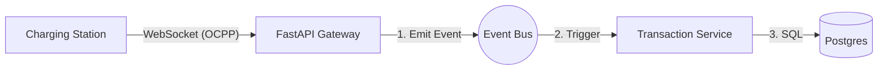
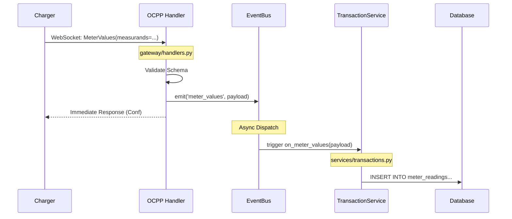
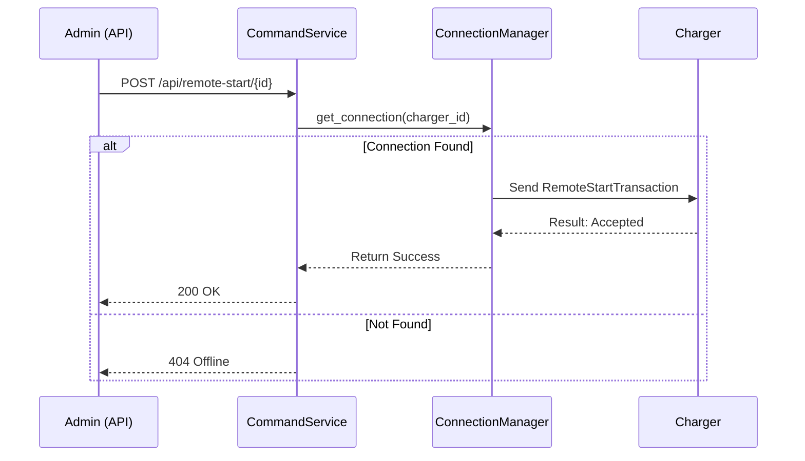

# System Architecture: The Event-Driven Monolith

This document details the new simplified architecture for the **Onetime Backend**. The system is designed as a **Modular Monolith** that runs as a single process but maintains loose coupling through an internal **In-Memory Event Bus**.

> **Design Goal**: Simplicity and stability for deployments of < 200 stations, running on low-cost hardware (e.g., Raspberry Pi).

## 1. High-Level Overview

We have removed distributed components (RabbitMQ, Nameko) in favor of Python's `asyncio` capabilities and an internal event loop.



### Components

1. **FastAPI Gateway**: Handles WebSocket connections and HTTP APIs.
2. **Event Bus (`pyee`)**: A lightweight in-memory pub/sub mechanism.
3. **Services**: Logic modules (Transaction, Auth, Config) that subscribe to the Event Bus and interact with the Database.
4. **Database**: PostgreSQL for persistent storage.

---

## 2. Incoming Flow: Charger → System

**Scenario**: A Charger sends `MeterValues`.



### Key Benefits

- **Non-Blocking**: The WebSocket handler responds to the charger immediately after emitting the event. Database writes happen asynchronously.
- **Decoupled**: The `OCPP Handler` doesn't know about the `TransactionService`. It just announces "Hey, I got meter values!".

---

## 3. Outgoing Flow: System → Charger

**Scenario**: An Admin clicks "Remote Start" in the dashboard.



### Direct Access

Since everything runs in one process, the API can directly access the `ConnectionManager` (Singleton) to find the active WebSocket and send data. No external message queue is needed to route the command.

---

## 4. Technology Stack

- **Language**: Python 3.10+
- **Web Framework**: `FastAPI` (WebSockets & HTTP)
- **OCPP Library**: `mobilityhouse/ocpp`
- **Event Bus**: `pyee` (AsyncIO EventEmitter)
- **Database**: `PostgreSQL` (+ `SQLAlchemy` / `Alembic`)
- **Runtime**: Single Docker Container

## 5. Directory Structure Plan

```text
onetime_backend/
├── app/
│   ├── gateway/
│   │   ├── connection_manager.py  # WebSocket Registry
│   │   └── ocpp_handler.py        # Protocol Translator
│   ├── services/
│   │   ├── events.py              # The shared EventBus instance
│   │   ├── transactions.py        # Logic: Start/Stop/MeterValues
│   │   └── auth.py                # Logic: Authorize tags
│   ├── main.py                    # Entrypoint (FastAPI app)
│   └── models.py                  # Database Models
├── migrations/                    # Alembic Migrations
├── tests/
├── Dockerfile
└── docker-compose.yml
```
