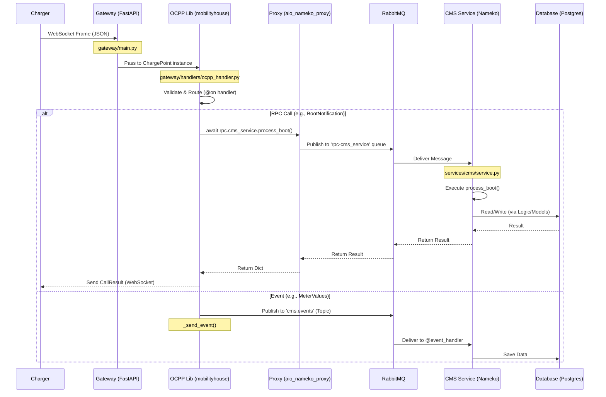
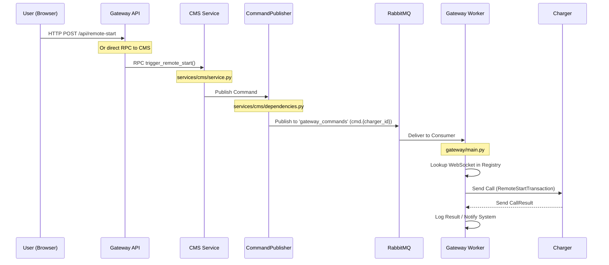

# System Architecture & Data Flow

This document details the architecture of the OCPP Backend, focusing on the data flow for incoming messages (Charger to System) and outgoing commands (System to Charger).

## 1. Incoming Flow: Charger → Database
**Scenario:** A Charging Station sends a `BootNotification` or `MeterValues`.

### Detailed Steps
1.  **The Wire**: The Charger sends a WebSocket frame to the **Gateway**.
2.  **The Translator**: The `mobilityhouse/ocpp` library inside the Gateway validates the message and routes it to the specific handler (e.g., `on_boot_notification`).
3.  **The Bridge**: The handler uses `aio_nameko_proxy` to make an RPC call to the **CMS Service** (for critical operations) or publishes an event to **RabbitMQ** (for data logging).
4.  **The Brain**: The **CMS Service** (Nameko) receives the request.
    *   **RPC**: It processes the logic, interacts with the **Database**, and returns a plain dictionary response.
    *   **Event**: It consumes the message asynchronously and persists data to the **Database**.
5.  **The Response**: For RPC calls, the result travels back through RabbitMQ to the Gateway, where the library wraps it in a standard OCPP response and sends it back to the Charger.

---

## 2. Outgoing Flow: Frontend → Charger
**Scenario:** An Admin clicks "Remote Start" on the Dashboard.

### Detailed Steps
1.  **The Trigger**: The Frontend (or API client) initiates an action (e.g., calling a CMS RPC method like `trigger_remote_start`).
2.  **The Command**: The **CMS Service** executes the trigger logic. Instead of talking to the charger directly (which it can't), it uses the `CommandPublisher` dependency.
3.  **The Transport**: The Publisher sends a message to the `gateway_commands` exchange in **RabbitMQ** with a routing key targeting the specific charger (e.g., `cmd.1234`).
4.  **The Routing**: RabbitMQ routes the message to the **Gateway** instance that is subscribed to that topic.
5.  **The Execution**:
    *   The **Gateway** consumes the message.
    *   It looks up the active WebSocket connection for `charger_id` in its `ConnectionRegistry`.
    *   It retrieves the `ChargePoint` instance.
    *   It calls the generic `send_admin_command` method.
6.  **The Wire**: The `mobilityhouse/ocpp` library constructs the OCPP message and sends it over the WebSocket to the **Charger**.
7.  **The Feedback**: The Charger responds, and the Gateway logs the result (or could publish it back to a response queue).
